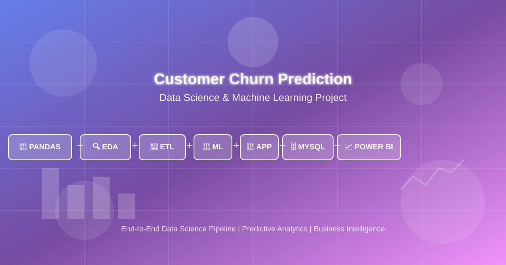

# 📊 Customer Churn Prediction - Data Science & ML Project

<div align="center">
  


**A comprehensive end-to-end data science project for predicting customer churn using PANDAS + EDA + ETL + ML + APP + MYSQL + POWER BI**

</div>

---

## 🎯 Project Overview

This project implements a complete **Customer Churn Prediction** solution combining data engineering, exploratory data analysis (EDA), machine learning, and business intelligence. The project covers the entire data science lifecycle from raw data processing, through comprehensive EDA, to deployment and visualization using **PANDAS**, **EDA**, **ETL**, **ML**, **APP**, **MYSQL**, and **POWER BI**.

## 🚀 Tech Stack

<div align="center">

| Technology | Purpose | Status |
|------------|---------|--------|
| 🐼 **PANDAS** | Data manipulation and analysis | ✅ |
| 🔍 **EDA** | Exploratory Data Analysis | ✅ |
| 🔄 **ETL** | Extract, Transform, Load pipeline | ✅ |
| 🤖 **ML** | Machine Learning models | ✅ |
| 📱 **APP** | Streamlit web application | ✅ |
| 🗄️ **MYSQL** | Database queries and storage | ✅ |
| 📈 **POWER BI** | Business Intelligence dashboards | ✅ |

</div>

## 📁 Project Structure

```
data-science-customer-churn-project/
│
├── 📂 app(streamlit)/           # Streamlit web application
│   └── app1.py.py              # Main application file
│
├── 📂 data_set/                 # Dataset management
│   ├── 📂 clean_data_set/      # Processed datasets
│   │   └── clean.csv
│   ├── 📂 data_cleaning_code/  # Data cleaning notebooks
│   │   └── g_cleaning_code.ipynb
│   └── 📂 messy_data_set/      # Raw datasets
│       └── customer_churn_messy.csv
│
├── 📂 EDA/                      # Exploratory Data Analysis
│   └── EDA.py                  # Analysis scripts
│
├── 📂 ETL/                      # ETL Pipeline
│   └── ETL.py.py               # Extract, Transform, Load processes
│
├── 📂 model(ML)/                # Machine Learning Models
│   └── model.py.py             # ML model implementation
│
├── 📂 MYSQL/                    # Database Queries
│   └── churn project querie.sql # SQL queries for data extraction
│
├── 📂 power bi/                 # Power BI Dashboards
│   ├── Screenshot 2026-01-10 063738.png
│   └── Screenshot 2026-01-10 063806.png
│
├── 📂 project images/           # Project screenshots and visualizations
│   └── [Multiple visualization screenshots]
│
└── README.md                    # Project documentation
```

## 🛠️ Features

### 1. 📊 Data Processing
- **Data Cleaning**: Comprehensive data cleaning pipeline using Pandas
- **ETL Pipeline**: Automated Extract, Transform, Load processes
- **Data Quality**: Handles missing values, outliers, and data inconsistencies

### 2. 🔍 Exploratory Data Analysis (EDA)
- Statistical analysis and data profiling
- Visualization of customer behavior patterns
- Feature distribution analysis
- Correlation analysis between features and churn

### 3. 🤖 Machine Learning Models
- Predictive modeling for customer churn
- Model training and evaluation
- Performance metrics and validation
- Model serialization for deployment

### 4. 📱 Streamlit Web Application
- Interactive user interface for predictions
- Real-time churn probability calculation
- User-friendly dashboard for model insights

### 5. 🗄️ MySQL Database Integration
- Data storage and retrieval
- Optimized SQL queries for analysis
- Database schema management

### 6. 📈 Power BI Dashboards
- Business intelligence visualizations
- Interactive dashboards for stakeholders
- Key performance indicators (KPIs)
- Customer churn insights and trends

## 📋 Getting Started

### Prerequisites

```bash
# Required Python packages
pandas
numpy
scikit-learn
streamlit
mysql-connector-python
matplotlib
seaborn
powerbiclient  # Optional, for Power BI integration
```

### Installation

1. **Clone the repository**
   ```bash
   git clone https://github.com/yourusername/data-science-customer-churn-project.git
   cd data-science-customer-churn-project
   ```

2. **Install dependencies**
   ```bash
   pip install -r requirements.txt
   ```

3. **Set up MySQL database**
   - Configure database connection in `MYSQL/churn project querie.sql`
   - Import data using provided SQL scripts

4. **Run the Streamlit app**
   ```bash
   cd app(streamlit)
   streamlit run app1.py.py
   ```

## 🔄 Workflow

```
Raw Data → ETL Pipeline → Clean Data → EDA → Feature Engineering 
→ ML Model Training → Model Evaluation → Deployment (Streamlit App)
→ Power BI Visualization → Business Insights
```

## 📊 Key Metrics

- **Model Performance**: [Add your model metrics here]
- **Data Quality**: [Add data quality metrics]
- **Business Impact**: [Add business impact metrics]

## 🖼️ Visualizations

Check out the visualizations in the `project images/` folder and Power BI dashboards in the `power bi/` folder for insights into:
- Customer churn patterns
- Feature importance
- Model performance metrics
- Business intelligence dashboards

## 👥 Contributing

Contributions are welcome! Please feel free to submit a Pull Request.

## 📝 License

This project is licensed under the MIT License - see the LICENSE file for details.

## 👤 Author

**Your Name**
- GitHub: [git hub avinash](https://github.com/avinashreddy0)
- LinkedIn: [AVINASH LinkedIn](https://www.linkedin.com/in/avinash-reddy-induri-4662b832a/)

## 🙏 Acknowledgments

- Data science community for best practices
- Open-source libraries and frameworks
- All contributors and reviewers

---

<div align="center">

**Made with ❤️ using PANDAS + EDA + ETL + ML + APP + MYSQL + POWER BI**

⭐ Star this repo if you found it helpful!

</div>
